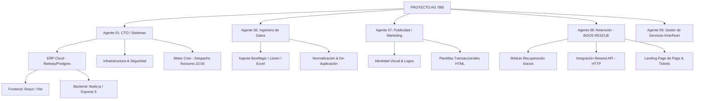

# 🏛️ ESTRUCTURA DEL PROYECTO — THE BOOS BOX ERP (AG TBB)
**Versión de Respaldo:** 1.0 (Mayo 2026)

Este documento detalla la arquitectura de agentes e infraestructura del sistema de gestión integral de The Boos Box.

---

## 🏗️ ÁRBOL ESTRUCTURAL DEL SISTEMA

---

## 👥 DEPARTAMENTOS Y AGENTES

### 🛡️ Agente 01: CTO / Sistemas
*   **Responsabilidad:** Estabilidad del servidor, despliegues en Railway y ruteo de red.
*   **Capacidad Nueva:** **Motor Cron Automático** configurado para tareas programadas (Chile TZ).
*   **Sub-Agentes:** Monitor de Status, Gestor de SSL, Guardián de Despacho.

### 📊 Agente 06: Ingeniero de Datos
*   **Responsabilidad:** Procesamiento de carteras de socios e inteligencia financiera.
*   **Sub-Agentes:** Validador de RUTs, Detector de Duplicados, Procesador de Cartera 2024 (Alumnosfuga).

### 🎨 Agente 07: Publicidad / Marketing
*   **Responsabilidad:** Comunicación con el cliente y diseño de experiencia.
*   **Sub-Agentes:** Diseñador de Email, Estratega de Retención.

### 🥊 Agente 08: Retención (BOOS RESCUE)
*   **Responsabilidad:** El "brazo armado" de ventas. Recuperar socios inactivos.
*   **Capacidad Nueva:** **Despacho Automático vía Resend** y **Historial de Gestión Dinámico**.
*   **Sub-Agentes:** 
    *   **Gestor de WhatsApp:** Envío de promos y contacto directo.
    *   **Motor de Email (NUEVO):** Cola de despacho inteligente para campañas nocturnas.
    *   **Monitor de Deserción:** Alertas automáticas de inasistencia (4 días).
    *   **Validador de Comprobantes:** Generador de Tickets (TBB-XXXX).
    *   **Estratega de Onboarding:** Plan 30/60/90 para nuevos reingresos.

### 🏥 Agente 09: Gestor de Servicios (Sede Marina)
*   **Responsabilidad:** Monetizar y gestionar la sala de Kine/Nutri.
*   **Sub-Agentes:**
    *   **Control de Citas:** Agenda integrada en el ERP.
    *   **Gestor de Comisiones:** Cálculo automático del 25% ($5.000/sesión).
    *   **Promotor de Bundles:** Venta cruzada de sesiones en renovaciones de planes.

---

## 📡 FLUJO DE INFORMACIÓN (INGRESOS/EGRESOS)

### 📥 Fuentes de Ingresos (Money In)
*   **BoxMagic:** Maestro de membresías.
*   **VirtualPos:** Pasarela de pagos.
*   **Lioren:** Ventas facturadas.
*   **Boos Rescue:** Captación directa de alumnos inactivos.

### 📤 Fuentes de Egresos (Money Out)
*   **Lioren:** Registro de compras y gastos.
*   **Cartolas Bancarias:** Conciliación de egresos reales.
*   **Caja Chica:** Registros manuales del ERP.

---
*Documento de respaldo generado para la administración de The Boos Box — 2026*
